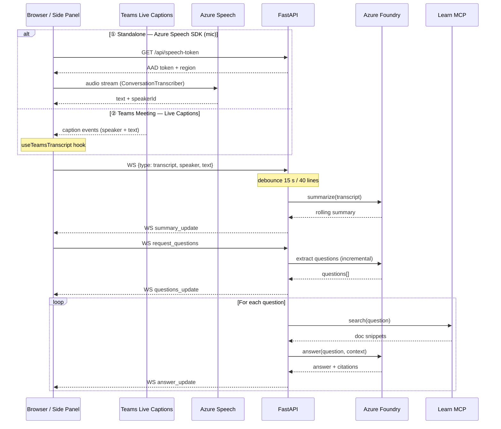

# RealtimeQA

[English](README.md) | **日本語** | [中文](README.zh-CN.md)

[](LICENSE)
[](https://github.com/lijunliu-gh/realtime-qa-app/releases/latest)
[](backend/)
[](frontend/)
[](frontend/)
[](frontend/)
[](https://learn.microsoft.com/azure/ai-services/speech-service/)
[](https://learn.microsoft.com/azure/ai-services/openai/)
[](teams/)

> Real-time technical Q&A and meeting-notes web app — transcribe speech, summarize conversations, and answer questions with cited Microsoft Learn docs.

リアルタイム技術QA + 議事録作成 Web アプリ

## Features / 機能 (MVP)

| # | Feature | Tech |
|---|---------|------|
| ① | **Live Transcription** — 音声をリアルタイムで文字起こし（多言語 / 話者識別対応） | Azure Speech SDK |
| ② | **Rolling Summary** — 会話を自動要約 | Azure Foundry (GPT) |
| ③ | **Q&A with Citations** — 質問を抽出し引用付き回答を生成 | Foundry + Microsoft Learn MCP |
| ④ | **Teams Side Panel** — Teams 会議のライブキャプションから QA を実行 | Teams JS SDK + Live Captions |

## Architecture / アーキテクチャ


> 📐 Editable source: [`docs/architecture.excalidraw`](docs/architecture.excalidraw) — open in [Excalidraw](https://excalidraw.com)

### Data Flow (Sequence)



> 📐 Editable diagram: [`docs/dataflow.excalidraw`](docs/dataflow.excalidraw) — open in [Excalidraw](https://excalidraw.com)

## セットアップ

### 0. 前提
- Python 3.11+
- Node.js 18+
- **Chrome / Edge / Firefox / Safari**
- Azure サブスクリプション + Foundry リソース（gpt-5.4 デプロイ済み）
- Azure AI Services リソース（Speech 用、Entra ID 認証）

### 1. `backend/.env` を作成

```ini
# 必須
AZURE_OPENAI_ENDPOINT=https://<your-resource>.openai.azure.com
AZURE_OPENAI_DEPLOYMENT=<your-deployment-name>
# API キーが有効なら入れる。Foundry で無効化されている場合は空にして Entra ID で認証する。
AZURE_OPENAI_API_KEY=

# 任意
AZURE_OPENAI_API_VERSION=2024-10-21
MCP_LEARN_URL=https://learn.microsoft.com/api/mcp
ALLOWED_ORIGINS=http://localhost:5173
# Azure Speech (AIServices リソース)
AZURE_SPEECH_REGION=eastus2
AZURE_SPEECH_RESOURCE_ID=/subscriptions/<sub-id>/resourceGroups/<rg>/providers/Microsoft.CognitiveServices/accounts/<name>
# Foundry リソースが特定テナントなら指定（InteractiveBrowserCredential 用）
# AZURE_TENANT_ID=xxxxxxxx-xxxx-xxxx-xxxx-xxxxxxxxxxxx
```

### 2. Azure 認証（API キー無効時）

以下のいずれかで Entra ID 認証を有効化:

| 方法 | コマンド |
|------|----------|
| **Azure CLI**（推奨） | **Windows:** `winget install Microsoft.AzureCLI` / **macOS:** `brew install azure-cli` → 新シェルで `az login` |
| **Az PowerShell** | `Install-Module Az -Scope CurrentUser` → `Connect-AzAccount` |
| **何もしない** | 初回バックエンド起動時にブラウザが開き、サインインを促されます（`azure-identity-broker` 経由） |

バックエンドは `DefaultAzureCredential` → `InteractiveBrowserCredential` の順で試行します。

### 3. バックエンド起動

**Windows (PowerShell):**
```powershell
cd backend
py -3 -m venv .venv
.\.venv\Scripts\Activate
pip install -r requirements.txt
python -m uvicorn main:app --reload --port 8000
```

**macOS / Linux:**
```bash
cd backend
python3 -m venv .venv
source .venv/bin/activate
pip install -r requirements.txt
python -m uvicorn main:app --reload --port 8000
```

起動確認:
```powershell
curl http://localhost:8000/health
# {"status":"ok","sessions":0}
```

### 4. フロントエンド起動

```powershell
cd frontend
npm install
npm run dev
```

### 5. ブラウザで http://localhost:5173 を開く

- 言語セレクターで認識言語を選択（日本語 / English / 中文 / 한국어 / Français / Deutsch）
- 「開始」を押す → マイク許可 → Azure Speech SDK でリアルタイム文字起こし開始
- 喋ると左パネルに文字起こしが流れる（話者が自動識別される場合あり）
- 約 15 秒静かにするか 40 行貯まると Foundry が要約を更新
- 「🔍 抽出」を押すと質問を抽出 → 各質問について MCP で Learn を検索 → 引用付き回答が表示される
- 「📄 エクスポート」を押すと Markdown 議事録（要約 + 文字起こし + Q&A + 引用）をダウンロード
- **初回 Foundry 呼び出し時にブラウザでサインインが必要**（az login していない場合）

## ファイル構成

```
backend/
  main.py                     # FastAPI app, WebSocket, debounce/answer pipeline
  services/
    summarizer.py             # Foundry (Entra ID) — summary / questions / answer-with-context
    mcp_client.py             # Microsoft Learn MCP client (streamable HTTP)
  smoke_test.py               # Foundry + MCP の疎通確認
  smoke_mcp.py                # MCP 単独テスト (Azure 不要)

frontend/
  src/
    App.tsx                   # state コンテナ
    hooks/
      useWebSocket.ts         # WS プロトコル (transcript / summary / questions / answer)
      useSpeechRecognition.ts # Azure Speech SDK ラッパ + 話者識別
      useTeamsTranscript.ts   # Teams ライブキャプション → WS ブリッジ
    teams/
      TeamsConfig.tsx         # Teams タブ設定ページ
      TeamsSidePanel.tsx      # サイドパネル UI
    components/
      TranscriptionPanel.tsx
      SummaryPanel.tsx
      QAPanel.tsx             # 質問 + 回答 + 引用 URL

start-dev.ps1               # バックエンド + フロントエンド並行起動 (Windows)
start-dev.sh                # バックエンド + フロントエンド並行起動 (macOS / Linux)
start-tunnel.ps1            # Dev Tunnel 起動（Teams テスト用） (Windows)
start-tunnel.sh             # Dev Tunnel 起動 (macOS / Linux)

teams/
  README.md                   # Teams 統合の詳細ドキュメント
  appPackage/
    manifest.template.json    # Teams マニフェストテンプレート（占位符）
    color.png                 # 192x192 アイコン
    outline.png               # 32x32 アウトラインアイコン
```

## WebSocket プロトコル

クライアント → サーバ:
- `{type: "transcript", speaker, text}` — 新しい発話
- `{type: "set_language", language}` — 要約/QA の出力言語を設定（例: `"zh-CN"`, `"en-US"`）
- `{type: "request_summary"}` — 強制要約
- `{type: "request_questions"}` — 質問抽出 + 回答生成をキック
- `{type: "request_translate", target}` — 現在の要約を指定言語に翻訳

サーバ → クライアント:
- `{type: "transcript_snapshot", lines}` — 再接続時の全文
- `{type: "transcript_append", line}` — 1 行追記
- `{type: "summary_update", summary}` — 要約更新
- `{type: "summary_translated", translation, target_language}` — 要約の翻訳結果
- `{type: "questions_update", questions: [{text, answer?, citations?}]}` — 質問リスト
- `{type: "answer_update", index, question, answer, citations: [{title, url}]}` — 1 件分の回答到着
- `{type: "token_count", count}` — 累計 token 使用量
- `{type: "error", where, message}`

## Teams 会議サイドパネル (v3.0)

RealtimeQA を Microsoft Teams 会議のサイドパネルとして実行できます。
Teams の**ライブキャプション**を入力として利用し、
開いている本人だけに QA 結果が表示されます。

```
Teams Meeting (live captions) → Side Panel (React) → WebSocket → FastAPI → MCP + GPT → Answer
```

### スタンドアロン版との違い

| 項目 | スタンドアロン | Teams サイドパネル |
|------|---------------|-------------------|
| 音声入力 | Azure Speech SDK（マイク） | Teams ライブキャプション |
| 話者識別 | Guest1, Guest2（匿名） | キャプション提供の話者名（※未検証） |
| 認証 | Speech token | Entra ID (meeting context) |
| 可視性 | URL を知る全員 | パネルを開いた本人のみ |
| デプロイ | localhost / 任意 URL | HTTPS 必須 + Teams アプリパッケージ |

### Teams モードの起動方法

1. **バックエンド + フロントエンドを起動**
   ```powershell
   # Windows
   .\start-dev.ps1

   # macOS / Linux
   ./start-dev.sh
   ```

2. **Dev Tunnel で HTTPS 公開**（ローカルテスト時）
   ```powershell
   # Windows
   .\start-tunnel.ps1

   # macOS / Linux
   ./start-tunnel.sh
   ```

3. **manifest.json を作成**
   ```powershell
   cd teams/appPackage
   copy manifest.template.json manifest.json
   ```
   `manifest.json` を開き、以下を置換:
   - `{{APP_ID}}` → あなたの Entra App Registration ID
   - `{{DOMAIN}}` → dev tunnel ドメイン（例: `xxxxxx-5173.jpe1.devtunnels.ms`）

4. **Teams にサイドロード**
   ```powershell
   # Windows (PowerShell)
   cd teams/appPackage
   Compress-Archive -Path manifest.json, color.png, outline.png -DestinationPath ..\realtimeqa-teams.zip -Force

   # macOS / Linux
   cd teams/appPackage
   zip -r ../realtimeqa-teams.zip manifest.json color.png outline.png
   ```
   Teams → アプリ → カスタムアプリをアップロード → `realtimeqa-teams.zip`

5. **会議で使用**
   - 会議中に「+」→「RealtimeQA」を追加
   - サイドパネルが開き、ライブキャプションから自動で QA が実行される

### 前提条件

- Microsoft 365 テナント（サイドロード有効）
- Teams Admin Center でキャプション/文字起こしを有効化
- Entra App Registration（`manifest.template.json` 参照）

詳細は [`teams/README.md`](teams/README.md) を参照。

## 多言語出力 (v3.2)

要約、質問抽出、Q&A 回答が**音声認識の設定言語と同じ言語**で生成されるようになりました。フロントエンドがセッション開始時に `{type: "set_language", language}` を送信し、バックエンドが選択されたロケールに合わせてプロンプトを動的に構築します。

対応出力言語: 日本語、英語、中国語、韓国語、フランス語、ドイツ語（拡張可能）。

また、Speech SDK トークンが **8分ごとに自動更新**され、エラー時の自動復帰機能も追加されたため、約10分で文字起こしが停止する問題が修正されました。

## Dev Scripts / 開発スクリプト (v3.1)

| スクリプト | 説明 |
|-----------|------|
| `start-dev.ps1` | バックエンド (FastAPI:8000) + フロントエンド (Vite:5173) を並行起動 (Windows) |
| `start-tunnel.ps1` | Dev Tunnel を起動（Teams テスト用、HTTPS 公開） (Windows) |
| `start-dev.sh` | バックエンド + フロントエンドを並行起動 (macOS / Linux) |
| `start-tunnel.sh` | Dev Tunnel を起動 (macOS / Linux) |

**Windows (PowerShell):**
```powershell
# 通常開発
.\start-dev.ps1

# Teams テスト（別ターミナル）
.\start-tunnel.ps1
```

**macOS / Linux:**
```bash
# 通常開発
./start-dev.sh

# Teams テスト（別ターミナル）
./start-tunnel.sh
```

VS Code ユーザーは `Ctrl+Shift+B` でも起動できます（`.vscode/tasks.json` 定義済み）。

## 今後の拡張

- [x] ~~Azure Speech SDK に切り替え（多言語 / 話者識別）~~ → v2.0.0 で実装済み
- [x] ~~Teams 会議サイドパネル統合~~ → v3.0.0 で実装済み
- [x] ~~開発スクリプト自動化~~ → v3.1.0 で実装済み
- [x] ~~多言語出力（要約/QA が会議言語に合わせて回答）~~ → v3.2.0 で実装済み
- [x] ~~Speech トークン自動更新（約10分で停止する問題を修正）~~ → v3.2.0 で実装済み
- [x] ~~セッション永続化 + 再接続復元（長時間会議中のネットワーク切断に対応）~~ → v3.3.0 で実装済み
- [x] ~~議事録エクスポート（Markdown/PDF）~~ → Markdown エクスポートを v1.1.0 で実装済み
- [ ] セッション永続化 + 再接続復元（長時間会議中のネットワーク切断に対応）
- [x] ~~議事録エクスポート (Markdown/PDF)~~ → v1.1.0 で Markdown エクスポート実装済み
- [x] ~~質問の増分抽出（毎回全文を投げない）~~ → v1.2.0 で実装済み- [x] ~~要約翻訳機能（会議要約を別の言語にオンデマンド翻訳）~~ → v3.4.0 で実装済み
## License

This project is licensed under the [Apache License 2.0](LICENSE).

