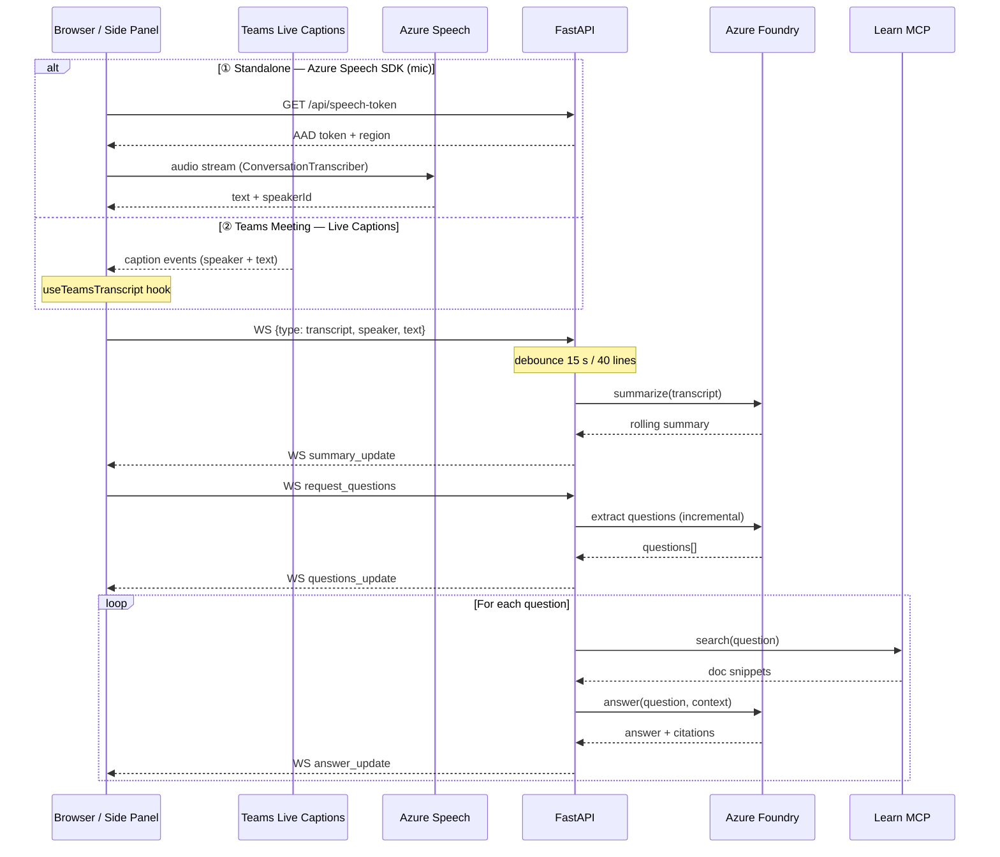

# RealtimeQA

**English** | [日本語](README.ja.md) | [中文](README.zh-CN.md)

[](LICENSE)
[](https://github.com/lijunliu-gh/realtime-qa-app/releases/latest)
[](backend/)
[](frontend/)
[](frontend/)
[](frontend/)
[](https://learn.microsoft.com/azure/ai-services/speech-service/)
[](https://learn.microsoft.com/azure/ai-services/openai/)
[](teams/)

> Real-time technical Q&A and meeting-notes web app — transcribe speech, summarize conversations, and answer questions with cited Microsoft Learn docs.

## Features (MVP)

| # | Feature | Tech |
|---|---------|------|
| ① | **Live Transcription** — Real-time speech-to-text (multilingual / speaker identification) | Azure Speech SDK |
| ② | **Rolling Summary** — Automatic conversation summarization | Azure Foundry (GPT) |
| ③ | **Q&A with Citations** — Extracts questions and generates answers with citations (multi-source) | Foundry + MCP (Learn + pluggable) |
| ④ | **Teams Side Panel** — Run QA from Teams meeting live captions | Teams JS SDK + Live Captions |
| ⑤ | **Auto-Backup & Export** — localStorage backup + auto-download Markdown on disconnect | Browser APIs |

## Architecture


> 📐 Editable source: [`docs/architecture.excalidraw`](docs/architecture.excalidraw) — open in [Excalidraw](https://excalidraw.com)

### Data Flow (Sequence)



> 📐 Editable diagram: [`docs/dataflow.excalidraw`](docs/dataflow.excalidraw) — open in [Excalidraw](https://excalidraw.com)

## Setup

### 0. Prerequisites
- Python 3.11+
- Node.js 18+
- **Chrome / Edge / Firefox / Safari**
- Azure subscription + Foundry resource (gpt-5.4 deployed)
- Azure AI Services resource (for Speech, Entra ID authentication)

### 1. Create `backend/.env`

```ini
# Required
AZURE_OPENAI_ENDPOINT=https://<your-resource>.openai.azure.com
AZURE_OPENAI_DEPLOYMENT=<your-deployment-name>
# Set this if API key is enabled. Leave empty to authenticate via Entra ID if disabled in Foundry.
AZURE_OPENAI_API_KEY=

# Optional
AZURE_OPENAI_API_VERSION=2024-10-21
MCP_LEARN_URL=https://learn.microsoft.com/api/mcp
# MCP_SERVERS=GitHub Docs|https://example.com/mcp, https://internal-wiki/mcp
ALLOWED_ORIGINS=http://localhost:5173
# Azure Speech (AI Services resource)
AZURE_SPEECH_REGION=eastus2
AZURE_SPEECH_RESOURCE_ID=/subscriptions/<sub-id>/resourceGroups/<rg>/providers/Microsoft.CognitiveServices/accounts/<name>
# Specify if the Foundry resource is in a specific tenant (for InteractiveBrowserCredential)
# AZURE_TENANT_ID=xxxxxxxx-xxxx-xxxx-xxxx-xxxxxxxxxxxx
```

### 2. Azure Authentication (when API key is disabled)

Enable Entra ID authentication using one of the following methods:

| Method | Command |
|--------|---------|
| **Azure CLI** (recommended) | **Windows:** `winget install Microsoft.AzureCLI` / **macOS:** `brew install azure-cli` → open a new shell → `az login` |
| **Az PowerShell** | `Install-Module Az -Scope CurrentUser` → `Connect-AzAccount` |
| **Do nothing** | On first backend startup, a browser window will open prompting you to sign in (via `azure-identity-broker`) |

The backend tries `DefaultAzureCredential` first, then falls back to `InteractiveBrowserCredential`.

### 3. Start the Backend

**Windows (PowerShell):**
```powershell
cd backend
py -3 -m venv .venv
.\.venv\Scripts\Activate
pip install -r requirements.txt
python -m uvicorn main:app --reload --port 8000
```

**macOS / Linux:**
```bash
cd backend
python3 -m venv .venv
source .venv/bin/activate
pip install -r requirements.txt
python -m uvicorn main:app --reload --port 8000
```

Verify it's running:
```powershell
curl http://localhost:8000/health
# {"status":"ok","sessions":0}
```

### 4. Start the Frontend

```powershell
cd frontend
npm install
npm run dev
```

### 5. Open http://localhost:5173 in your browser

- Select the recognition language from the language selector (Japanese / English / Chinese / Korean / French / German)
- Click "Start" → allow microphone access → real-time transcription begins via Azure Speech SDK
- Speech appears in the left panel as you talk (speakers may be automatically identified)
- After ~15 seconds of silence or 40 accumulated lines, Foundry updates the summary
- Click "🔍 Extract" to extract questions → each question is searched on Learn via MCP → answers with citations are displayed
- Click "📄 Export" to download a Markdown transcript (summary + transcription + Q&A + citations)
- **On the first Foundry call, you may need to sign in via browser** (if you haven't run `az login`)

## Project Structure

```
backend/
  main.py                     # FastAPI app, WebSocket, debounce/answer pipeline
  services/
    summarizer.py             # Foundry (Entra ID) — summary / questions / answer-with-context
    mcp_client.py             # MCP search providers + aggregator (multi-source, streamable HTTP)
  smoke_test.py               # Foundry + MCP connectivity check
  smoke_mcp.py                # MCP-only test (no Azure required)

frontend/
  src/
    App.tsx                   # State container
    hooks/
      useWebSocket.ts         # WS protocol (transcript / summary / questions / answer)
      useSpeechRecognition.ts # Azure Speech SDK wrapper + speaker identification
      useTeamsTranscript.ts   # Teams live captions → WS bridge
    teams/
      TeamsConfig.tsx         # Teams tab configuration page
      TeamsSidePanel.tsx      # Side panel UI
    components/
      TranscriptionPanel.tsx
      SummaryPanel.tsx
      QAPanel.tsx             # Questions + answers + citation URLs

.env.example                # Environment config template (tunnel name, domain, app ID)
start-dev.ps1               # Start backend + frontend in parallel (Windows)
start-dev.sh                # Start backend + frontend in parallel (macOS / Linux)
start-tunnel.ps1            # Start Dev Tunnel (for Teams testing) (Windows)
start-tunnel.sh             # Start Dev Tunnel (macOS / Linux)

teams/
  README.md                   # Detailed Teams integration documentation
  appPackage/
    manifest.template.json    # Teams manifest template (with placeholders)
    color.png                 # 192x192 icon
    outline.png               # 32x32 outline icon
```

## WebSocket Protocol

Client → Server:
- `{type: "transcript", speaker, text}` — New utterance
- `{type: "set_language", language}` — Set output language for summary/QA (e.g. `"zh-CN"`, `"en-US"`)
- `{type: "request_summary"}` — Force summary
- `{type: "request_questions"}` — Kick off question extraction + answer generation
- `{type: "request_translate", target}` — Translate current summary into target language

Server → Client:
- `{type: "transcript_snapshot", lines}` — Full transcript on reconnect
- `{type: "transcript_append", line}` — Append one line
- `{type: "summary_update", summary}` — Summary update
- `{type: "summary_translated", translation, target_language}` — Translation of current summary
- `{type: "questions_update", questions: [{text, answer?, citations?}]}` — Question list
- `{type: "answer_update", index, question, answer, citations: [{title, url}]}` — Single answer arrival
- `{type: "token_count", count}` — Cumulative token usage
- `{type: "error", where, message}`

## Teams Meeting Side Panel (v3.0)

RealtimeQA can run as a side panel in Microsoft Teams meetings.
It uses Teams **live captions** as input, and QA results are visible
only to the person who opened the panel.

```
Teams Meeting (live captions) → Side Panel (React) → WebSocket → FastAPI → MCP + GPT → Answer
```

### Differences from Standalone Mode

| Item | Standalone | Teams Side Panel |
|------|-----------|-----------------|
| Audio input | Azure Speech SDK (microphone) | Teams live captions |
| Speaker identification | Guest1, Guest2 (anonymous) | Speaker name from captions (unverified) |
| Authentication | Speech token | Entra ID (meeting context) |
| Visibility | Anyone with the URL | Only the person who opened the panel |
| Deployment | localhost / any URL | HTTPS required + Teams app package |

### How to Launch in Teams Mode

1. **Start the backend + frontend**
   ```powershell
   # Windows
   .\start-dev.ps1

   # macOS / Linux
   ./start-dev.sh
   ```

2. **Expose via Dev Tunnel over HTTPS** (for local testing)
   ```powershell
   # Windows
   .\start-tunnel.ps1

   # macOS / Linux
   ./start-tunnel.sh
   ```

3. **Configure `.env` and generate manifest**
   ```bash
   cp .env.example .env
   # Edit .env: set TUNNEL_NAME, TEAMS_DOMAIN, TEAMS_APP_ID
   python teams/generate_package.py
   ```
   This reads `.env`, substitutes `{{APP_ID}}` and `{{DOMAIN}}` in the template, generates icons, and packages the zip.

4. **Sideload into Teams**

   The previous step generates `teams/realtimeqa-teams.zip` automatically.

   Teams → Apps → Upload a custom app → `realtimeqa-teams.zip`

5. **Use in a meeting**
   - During a meeting, click "+" → add "RealtimeQA"
   - The side panel opens and QA runs automatically from live captions

### Prerequisites

- Microsoft 365 tenant (sideloading enabled)
- Captions/transcription enabled in Teams Admin Center
- Entra App Registration (see `manifest.template.json`)

For details, see [`teams/README.md`](teams/README.md).

## Multi-language Output (v3.2)

Summary, question extraction, and Q&A answers are now generated in the **same language as the speech recognition setting**. The frontend sends `{type: "set_language", language}` at session start, and the backend dynamically constructs prompts for the selected locale.

Supported output languages: Japanese, English, Chinese, Korean, French, German (extensible).

Additionally, the Speech SDK token is now **auto-refreshed every 8 minutes** with automatic error recovery, fixing the issue where transcription stopped after ~10 minutes.

## Dev Scripts (v3.1)

| Script | Description |
|--------|-------------|
| `start-dev.ps1` | Start backend (FastAPI:8000) + frontend (Vite:5173) in parallel (Windows) |
| `start-tunnel.ps1` | Start Dev Tunnel (for Teams testing, HTTPS exposure) (Windows) |
| `start-dev.sh` | Start backend + frontend in parallel (macOS / Linux) |
| `start-tunnel.sh` | Start Dev Tunnel (macOS / Linux) |

**Windows (PowerShell):**
```powershell
# Normal development
.\start-dev.ps1

# Teams testing (in a separate terminal)
.\start-tunnel.ps1
```

**macOS / Linux:**
```bash
# Normal development
./start-dev.sh

# Teams testing (in a separate terminal)
./start-tunnel.sh
```

VS Code users can also launch via `Ctrl+Shift+B` (defined in `.vscode/tasks.json`).

## Roadmap

- [x] ~~Switch to Azure Speech SDK (multilingual / speaker identification)~~ → Implemented in v2.0.0
- [x] ~~Teams meeting side panel integration~~ → Implemented in v3.0.0
- [x] ~~Dev script automation~~ → Implemented in v3.1.0
- [x] ~~Multi-language output (summary/QA responds in meeting language)~~ → Implemented in v3.2.0
- [x] ~~Speech token auto-refresh (fix 10-min timeout)~~ → Implemented in v3.2.0
- [x] ~~Session persistence + reconnect restore (survive network drops during long meetings)~~ → Implemented in v3.3.0
- [x] ~~Meeting notes export (Markdown/PDF)~~ → Markdown export implemented in v1.1.0
- [x] ~~Incremental question extraction (avoid sending full transcript each time)~~ → Implemented in v1.2.0
- [x] ~~Summary translation (translate meeting summary into a different language on demand)~~ → Implemented in v3.4.0
- [x] ~~Auto-backup & auto-export on disconnect (prevent data loss on page refresh/Teams iframe reload)~~ → Implemented in v3.5.2
- [x] ~~Manual clear (one-click wipe of transcript/summary/Q&A on both client and server)~~ → Implemented in v3.6.0
- [x] ~~Multi-source doc grounding (parallel fan-out search across multiple MCP servers, round-robin merge)~~ → Implemented in v3.7.0
- [ ] Standalone desktop app (Tauri installer) — see [docs/desktop-app-plan.md](docs/desktop-app-plan.md)

## License

This project is licensed under the [Apache License 2.0](LICENSE).
