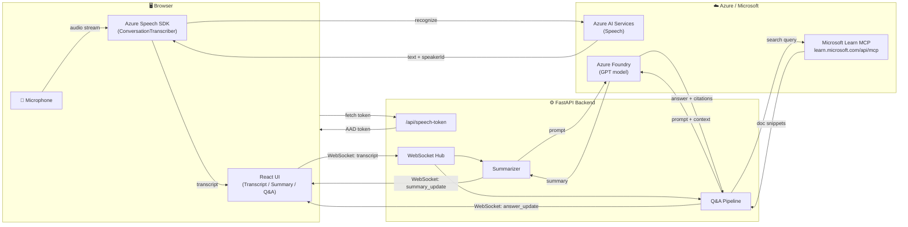
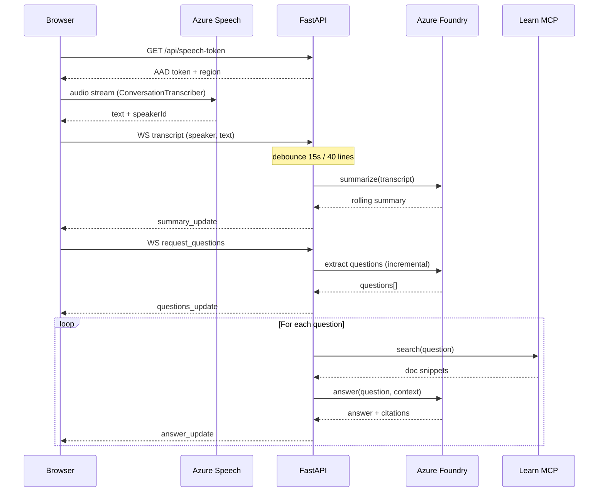

# RealtimeQA

[](LICENSE)
[](https://github.com/lijunliu-gh/realtime-qa-app/releases/latest)
[](backend/)
[](frontend/)
[](frontend/)
[](https://learn.microsoft.com/azure/ai-services/speech-service/)
[](https://learn.microsoft.com/azure/ai-services/openai/)

> Real-time technical Q&A and meeting-notes web app — transcribe speech, summarize conversations, and answer questions with cited Microsoft Learn docs.

リアルタイム技術QA + 議事録作成 Web アプリ

## Features / 機能 (MVP)

| # | Feature | Tech |
|---|---------|------|
| ① | **Live Transcription** — 音声をリアルタイムで文字起こし（多言語 / 話者識別対応） | Azure Speech SDK |
| ② | **Rolling Summary** — 会話を自動要約 | Azure Foundry (GPT) |
| ③ | **Q&A with Citations** — 質問を抽出し引用付き回答を生成 | Foundry + Microsoft Learn MCP |

## Architecture / アーキテクチャ



### Data Flow (Sequence)



## セットアップ (Windows)

### 0. 前提
- Python 3.11+
- Node.js 18+
- **Chrome / Edge / Firefox / Safari**
- Azure サブスクリプション + Foundry リソース（gpt-5.4 デプロイ済み）
- Azure AI Services リソース（Speech 用、Entra ID 認証）

### 1. `backend/.env` を作成

```ini
# 必須
AZURE_OPENAI_ENDPOINT=https://<your-resource>.openai.azure.com
AZURE_OPENAI_DEPLOYMENT=<your-deployment-name>
# API キーが有効なら入れる。Foundry で無効化されている場合は空にして Entra ID で認証する。
AZURE_OPENAI_API_KEY=

# 任意
AZURE_OPENAI_API_VERSION=2024-10-21
MCP_LEARN_URL=https://learn.microsoft.com/api/mcp
ALLOWED_ORIGINS=http://localhost:5173
# Azure Speech (AIServices リソース)
AZURE_SPEECH_REGION=eastus2
AZURE_SPEECH_RESOURCE_ID=/subscriptions/<sub-id>/resourceGroups/<rg>/providers/Microsoft.CognitiveServices/accounts/<name>
# Foundry リソースが特定テナントなら指定（InteractiveBrowserCredential 用）
# AZURE_TENANT_ID=xxxxxxxx-xxxx-xxxx-xxxx-xxxxxxxxxxxx
```

### 2. Azure 認証（API キー無効時）

以下のいずれかで Entra ID 認証を有効化:

| 方法 | コマンド |
|------|----------|
| **Azure CLI**（推奨） | `winget install Microsoft.AzureCLI` → 新シェルで `az login` |
| **Az PowerShell** | `Install-Module Az -Scope CurrentUser` → `Connect-AzAccount` |
| **何もしない** | 初回バックエンド起動時にブラウザが開き、サインインを促されます（`azure-identity-broker` 経由） |

バックエンドは `DefaultAzureCredential` → `InteractiveBrowserCredential` の順で試行します。

### 3. バックエンド起動

```powershell
cd backend
py -3 -m venv .venv
.\.venv\Scripts\Activate
pip install -r requirements.txt
python -m uvicorn main:app --reload --port 8000
```

起動確認:
```powershell
curl http://localhost:8000/health
# {"status":"ok","sessions":0}
```

### 4. フロントエンド起動

```powershell
cd frontend
npm install
npm run dev
```

### 5. ブラウザで http://localhost:5173 を開く

- 言語セレクターで認識言語を選択（日本語 / English / 中文 / 한국어 / Français / Deutsch）
- 「開始」を押す → マイク許可 → Azure Speech SDK でリアルタイム文字起こし開始
- 喋ると左パネルに文字起こしが流れる（話者が自動識別される場合あり）
- 約 15 秒静かにするか 40 行貯まると Foundry が要約を更新
- 「🔍 抽出」を押すと質問を抽出 → 各質問について MCP で Learn を検索 → 引用付き回答が表示される
- 「📄 エクスポート」を押すと Markdown 議事録（要約 + 文字起こし + Q&A + 引用）をダウンロード
- **初回 Foundry 呼び出し時にブラウザでサインインが必要**（az login していない場合）

## ファイル構成

```
backend/
  main.py                     # FastAPI app, WebSocket, debounce/answer pipeline
  services/
    summarizer.py             # Foundry (Entra ID) — summary / questions / answer-with-context
    mcp_client.py             # Microsoft Learn MCP client (streamable HTTP)
  smoke_test.py               # Foundry + MCP の疎通確認
  smoke_mcp.py                # MCP 単独テスト (Azure 不要)

frontend/
  src/
    App.tsx                   # state コンテナ
    hooks/
      useWebSocket.ts         # WS プロトコル (transcript / summary / questions / answer)
      useSpeechRecognition.ts # Web Speech API ラッパ + 自動再開
    components/
      TranscriptionPanel.tsx
      SummaryPanel.tsx
      QAPanel.tsx             # 質問 + 回答 + 引用 URL
```

## WebSocket プロトコル

クライアント → サーバ:
- `{type: "transcript", speaker, text}` — 新しい発話
- `{type: "request_summary"}` — 強制要約
- `{type: "request_questions"}` — 質問抽出 + 回答生成をキック

サーバ → クライアント:
- `{type: "transcript_snapshot", lines}` — 再接続時の全文
- `{type: "transcript_append", line}` — 1 行追記
- `{type: "summary_update", summary}` — 要約更新
- `{type: "questions_update", questions: [{text, answer?, citations?}]}` — 質問リスト
- `{type: "answer_update", index, question, answer, citations: [{title, url}]}` — 1 件分の回答到着
- `{type: "token_count", count}` — 累計 token 使用量
- `{type: "error", where, message}`

## 今後の拡張

- [x] ~~Azure Speech SDK に切り替え（多言語 / 話者識別）~~ → v2.0.0 で実装済み
- [ ] Redis SessionStore + 再接続復元 + 認証
- [x] ~~議事録エクスポート (Markdown/PDF)~~ → v1.1.0 で Markdown エクスポート実装済み
- [x] ~~質問の増分抽出（毎回全文を投げない）~~ → v1.2.0 で実装済み
- [ ] Azure Container Apps へデプロイ

## License

This project is licensed under the [Apache License 2.0](LICENSE).

