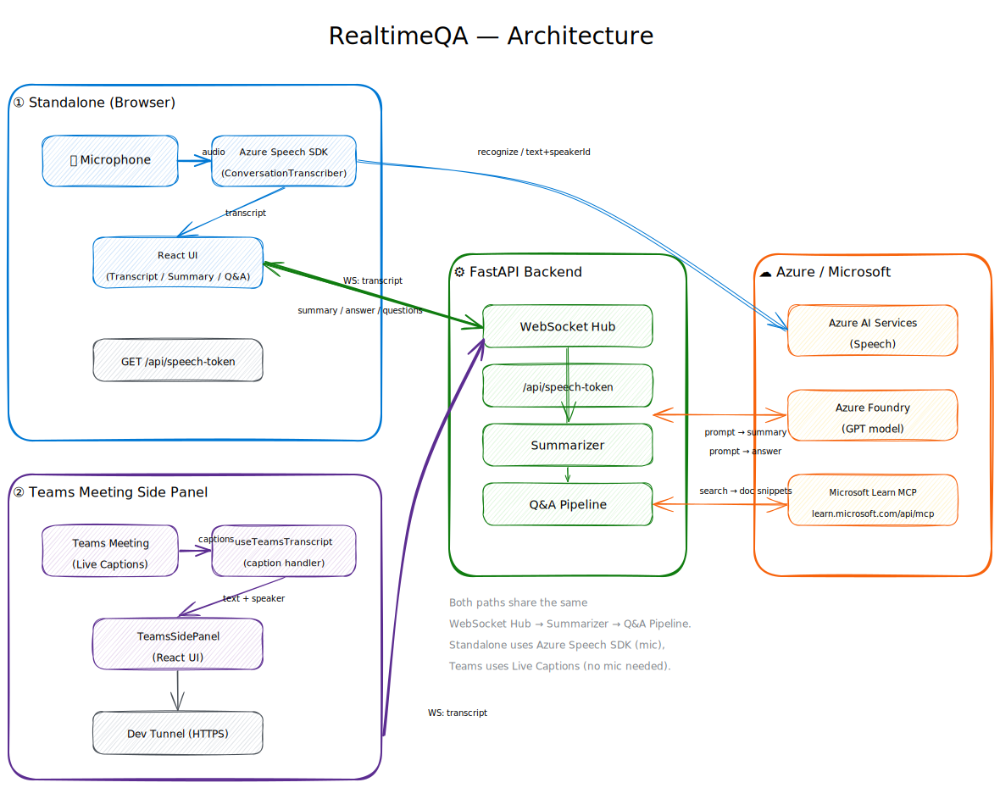
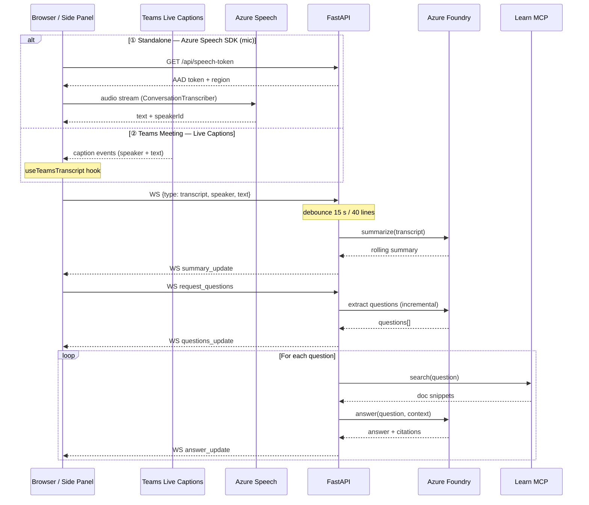

# RealtimeQA

[English](README.md) | [日本語](README.ja.md) | **中文**

[](LICENSE)
[](https://github.com/lijunliu-gh/realtime-qa-app/releases/latest)
[](backend/)
[](frontend/)
[](frontend/)
[](frontend/)
[](https://learn.microsoft.com/azure/ai-services/speech-service/)
[](https://learn.microsoft.com/azure/ai-services/openai/)
[](teams/)

> 实时技术问答与会议记录 Web 应用 —— 语音转录、对话摘要，并基于 Microsoft Learn 文档生成带引用的回答。

## 功能特性（MVP）

| # | 功能 | 技术 |
|---|------|------|
| ① | **实时转录（Live Transcription）** —— 实时语音转文字（多语言 / 说话人识别） | Azure Speech SDK |
| ② | **滚动摘要（Rolling Summary）** —— 自动对话摘要 | Azure Foundry (GPT) |
| ③ | **带引用的问答（Q&A with Citations）** —— 提取问题并生成带引用来源的回答 | Foundry + Microsoft Learn MCP |
| ④ | **Teams 侧边面板（Side Panel）** —— 在 Teams 会议中通过实时字幕运行问答 | Teams JS SDK + Live Captions |

## 架构



> 📐 可编辑源文件：[`docs/architecture.excalidraw`](docs/architecture.excalidraw) —— 使用 [Excalidraw](https://excalidraw.com) 打开

### 数据流（时序图）



> 📐 可编辑图表：[`docs/dataflow.excalidraw`](docs/dataflow.excalidraw) —— 使用 [Excalidraw](https://excalidraw.com) 打开

## 安装配置（Windows）

### 0. 前提条件
- Python 3.11+
- Node.js 18+
- **Chrome / Edge / Firefox / Safari**
- Azure 订阅 + Foundry 资源（已部署 gpt-5.4）
- Azure AI Services 资源（用于 Speech，使用 Entra ID 认证）

### 1. 创建 `backend/.env`

```ini
# Required
AZURE_OPENAI_ENDPOINT=https://<your-resource>.openai.azure.com
AZURE_OPENAI_DEPLOYMENT=<your-deployment-name>
# Set this if API key is enabled. Leave empty to authenticate via Entra ID if disabled in Foundry.
AZURE_OPENAI_API_KEY=

# Optional
AZURE_OPENAI_API_VERSION=2024-10-21
MCP_LEARN_URL=https://learn.microsoft.com/api/mcp
ALLOWED_ORIGINS=http://localhost:5173
# Azure Speech (AI Services resource)
AZURE_SPEECH_REGION=eastus2
AZURE_SPEECH_RESOURCE_ID=/subscriptions/<sub-id>/resourceGroups/<rg>/providers/Microsoft.CognitiveServices/accounts/<name>
# Specify if the Foundry resource is in a specific tenant (for InteractiveBrowserCredential)
# AZURE_TENANT_ID=xxxxxxxx-xxxx-xxxx-xxxx-xxxxxxxxxxxx
```

### 2. Azure 认证（API 密钥被禁用时）

通过以下方式之一启用 Entra ID 认证：

| 方式 | 命令 |
|------|------|
| **Azure CLI**（推荐） | `winget install Microsoft.AzureCLI` → 打开新终端 → `az login` |
| **Az PowerShell** | `Install-Module Az -Scope CurrentUser` → `Connect-AzAccount` |
| **无需操作** | 首次启动后端时，浏览器会自动弹出登录窗口（通过 `azure-identity-broker`） |

后端会优先尝试 `DefaultAzureCredential`，失败后回退到 `InteractiveBrowserCredential`。

### 3. 启动后端

```powershell
cd backend
py -3 -m venv .venv
.\.venv\Scripts\Activate
pip install -r requirements.txt
python -m uvicorn main:app --reload --port 8000
```

验证是否正常运行：
```powershell
curl http://localhost:8000/health
# {"status":"ok","sessions":0}
```

### 4. 启动前端

```powershell
cd frontend
npm install
npm run dev
```

### 5. 在浏览器中打开 http://localhost:5173

- 从语言选择器中选择识别语言（日语 / 英语 / 中文 / 韩语 / 法语 / 德语）
- 点击「Start」→ 允许麦克风权限 → 通过 Azure Speech SDK 开始实时转录
- 说话时，语音内容会出现在左侧面板中（可自动识别说话人）
- 静默约 15 秒或累计 40 行后，Foundry 会更新摘要
- 点击「🔍 Extract」提取问题 → 每个问题通过 MCP 在 Learn 上搜索 → 显示带引用的回答
- 点击「📄 Export」下载 Markdown 格式的记录（摘要 + 转录 + 问答 + 引用）
- **首次调用 Foundry 时，可能需要在浏览器中登录**（如果尚未执行 `az login`）

## 项目结构

```
backend/
  main.py                     # FastAPI 应用、WebSocket、防抖/回答流水线
  services/
    summarizer.py             # Foundry (Entra ID) — 摘要 / 问题提取 / 带上下文回答
    mcp_client.py             # Microsoft Learn MCP 客户端（Streamable HTTP）
  smoke_test.py               # Foundry + MCP 连接检查
  smoke_mcp.py                # 仅 MCP 测试（无需 Azure）

frontend/
  src/
    App.tsx                   # 状态容器
    hooks/
      useWebSocket.ts         # WS 协议（转录 / 摘要 / 问题 / 回答）
      useSpeechRecognition.ts # Azure Speech SDK 封装 + 说话人识别
      useTeamsTranscript.ts   # Teams 实时字幕 → WS 桥接
    teams/
      TeamsConfig.tsx         # Teams 标签页配置页面
      TeamsSidePanel.tsx      # 侧边面板 UI
    components/
      TranscriptionPanel.tsx
      SummaryPanel.tsx
      QAPanel.tsx             # 问题 + 回答 + 引用链接

start-dev.ps1               # 并行启动后端 + 前端
start-tunnel.ps1            # 启动 Dev Tunnel（用于 Teams 测试）

teams/
  README.md                   # Teams 集成详细文档
  appPackage/
    manifest.template.json    # Teams 清单模板（含占位符）
    color.png                 # 192x192 图标
    outline.png               # 32x32 轮廓图标
```

## WebSocket 协议

客户端 → 服务器：
- `{type: "transcript", speaker, text}` —— 新的语音片段
- `{type: "set_language", language}` —— 设置摘要/问答的输出语言（如 `"zh-CN"`, `"en-US"`）
- `{type: "request_summary"}` —— 强制生成摘要
- `{type: "request_questions"}` —— 触发问题提取 + 回答生成

服务器 → 客户端：
- `{type: "transcript_snapshot", lines}` —— 重连时的完整转录记录
- `{type: "transcript_append", line}` —— 追加一行
- `{type: "summary_update", summary}` —— 摘要更新
- `{type: "questions_update", questions: [{text, answer?, citations?}]}` —— 问题列表
- `{type: "answer_update", index, question, answer, citations: [{title, url}]}` —— 单个回答到达
- `{type: "token_count", count}` —— 累计 Token 用量
- `{type: "error", where, message}`

## Teams 会议侧边面板（v3.0）

RealtimeQA 可以作为侧边面板在 Microsoft Teams 会议中运行。
它使用 Teams **实时字幕（Live Captions）** 作为输入，问答结果仅对打开面板的人可见。

```
Teams Meeting (live captions) → Side Panel (React) → WebSocket → FastAPI → MCP + GPT → Answer
```

### 与独立模式的区别

| 项目 | 独立模式 | Teams 侧边面板 |
|------|----------|----------------|
| 音频输入 | Azure Speech SDK（麦克风） | Teams 实时字幕 |
| 说话人识别 | Guest1、Guest2（匿名） | 字幕中的说话人姓名（未验证） |
| 认证方式 | Speech Token | Entra ID（会议上下文） |
| 可见性 | 任何拥有 URL 的人 | 仅打开面板的人可见 |
| 部署方式 | localhost / 任意 URL | 需要 HTTPS + Teams 应用包 |

### 如何在 Teams 模式下启动

1. **启动后端 + 前端**
   ```powershell
   .\start-dev.ps1
   ```

2. **通过 Dev Tunnel 暴露 HTTPS**（用于本地测试）
   ```powershell
   .\start-tunnel.ps1
   ```

3. **创建 manifest.json**
   ```powershell
   cd teams/appPackage
   copy manifest.template.json manifest.json
   ```
   打开 `manifest.json` 并替换以下内容：
   - `{{APP_ID}}` → 您的 Entra 应用注册 ID
   - `{{DOMAIN}}` → 您的 Dev Tunnel 域名（例如 `xxxxxx-5173.jpe1.devtunnels.ms`）

4. **旁加载到 Teams**
   ```powershell
   cd teams/appPackage
   Compress-Archive -Path manifest.json, color.png, outline.png -DestinationPath ..\realtimeqa-teams.zip -Force
   ```
   Teams → 应用 → 上传自定义应用 → `realtimeqa-teams.zip`

5. **在会议中使用**
   - 在会议中点击「+」→ 添加「RealtimeQA」
   - 侧边面板打开后，问答功能将自动从实时字幕开始运行

### 前提条件

- Microsoft 365 租户（已启用旁加载）
- 在 Teams 管理中心启用字幕/转录功能
- Entra 应用注册（参见 `manifest.template.json`）

详细信息请参阅 [`teams/README.md`](teams/README.md)。

## 多语言输出（v3.2）

摘要、问题提取和问答回答现在会根据**语音识别设置的语言**生成对应语言的输出。前端在会议开始时发送 `{type: "set_language", language}`，后端根据选择的语言动态构建 Prompt。

支持的输出语言：日语、英语、中文、韩语、法语、德语（可扩展）。

此外，Speech SDK Token 现在**每 8 分钟自动刷新**，并增加了错误自动恢复机制，修复了转录约 10 分钟后停止的问题。

## 开发脚本（v3.1）

| 脚本 | 说明 |
|------|------|
| `start-dev.ps1` | 并行启动后端 (FastAPI:8000) + 前端 (Vite:5173) |
| `start-tunnel.ps1` | 启动 Dev Tunnel（用于 Teams 测试、HTTPS 暴露） |

```powershell
# 常规开发
.\start-dev.ps1

# Teams 测试（在另一个终端中执行）
.\start-tunnel.ps1
```

VS Code 用户也可通过 `Ctrl+Shift+B` 启动（定义在 `.vscode/tasks.json` 中）。

## 路线图

- [x] ~~切换到 Azure Speech SDK（多语言 / 说话人识别）~~ → 已在 v2.0.0 中实现
- [x] ~~Teams 会议侧边面板集成~~ → 已在 v3.0.0 中实现
- [x] ~~开发脚本自动化~~ → 已在 v3.1.0 中实现
- [x] ~~多语言输出（摘要/问答根据会议语言回答）~~ → 已在 v3.2.0 中实现
- [x] ~~Speech Token 自动刷新（修复约10分钟停止的问题）~~ → 已在 v3.2.0 中实现
- [ ] 会话持久化 + 重连恢复（应对长时间会议中的网络中断）
- [x] ~~会议记录导出（Markdown/PDF）~~ → Markdown 导出已在 v1.1.0 中实现
- [x] ~~增量问题提取（避免每次发送完整转录）~~ → 已在 v1.2.0 中实现

## 许可证

本项目使用 [Apache License 2.0](LICENSE) 许可证。
